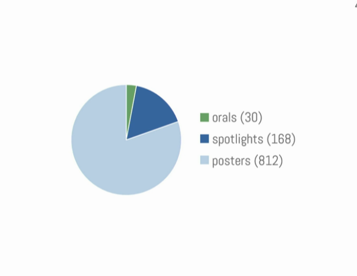
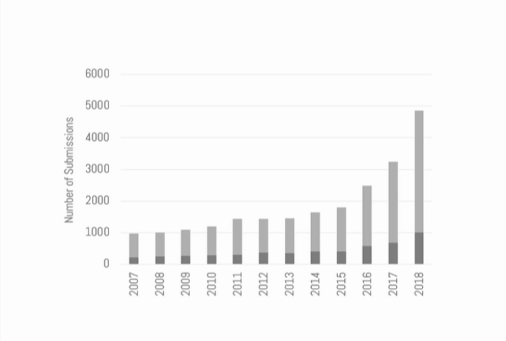
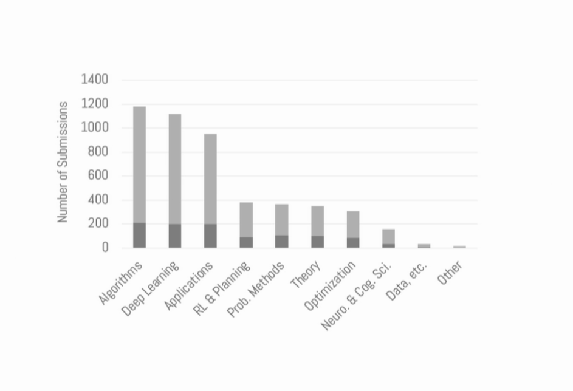
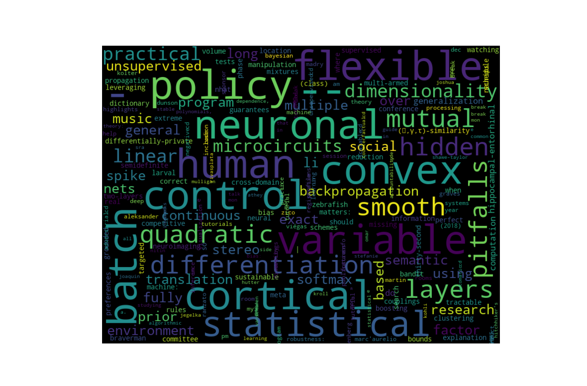
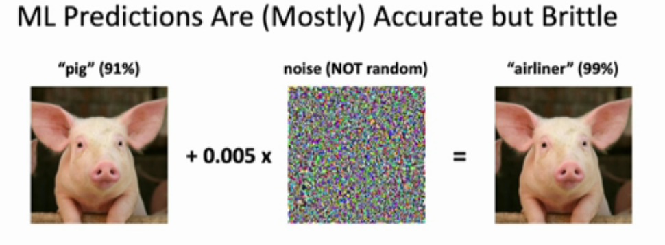

# [NeurIPS 2018](https://nips.cc) Summary Report

* [Overview and Statistics](#overview-and-statistics)
* [Conference Map](#conference-map)
* [Tutorials](#tutorials)
* [Highlights](#highlights)
* [Wisdom](#neurIPS2018-wisdom)

## Overview and Statistics

## Conference Map

Conference Schedule: https://nips.cc/Conferences/2018/Schedule

- **Tutorials**
- Talks: **Invited**, **Oral**, Spotlight
- Posters and Demonstrations
- Sponsor Demonstrations
- **Workshops**

## Tutorials
- Adversarial Robustness [[slides]](https://media.neurips.cc/Conferences/NIPS2018/Slides/adversarial_ml_slides_parts_1_4.pdf)

- Unsupervised Learning

- Automatic ML

- Statistical Learning

## Highlights
- Michael Levin: Bioelectric Computation

## Excerpts of Highlight Presentations
~ 30/15/7

* Algorithms
   * [**ConvRNN**](https://neuroailab.github.io/convrnns/files/convrnns-nips-2018-poster.pdf)
   * Modelling and unsupervised learning of symmetric deformable object categories, [pdf](http://papers.nips.cc/paper/8040-modelling-and-unsupervised-learning-of-symmetric-deformable-object-categories.pdf)
   * Learning Invariances using the Marginal Likelihood, [pdf](http://papers.nips.cc/paper/8199-learning-invariances-using-the-marginal-likelihood.pdf)
   * [Training deep learning based denoisers without ground truth data](https://drive.google.com/file/d/1yew0KcVrW4A8QPYgsMe3elCAAszhBXWs/view)
   * [**Deep Anomaly Detection with Geometic Transformations**](https://drive.google.com/file/d/1ZpoC35XzoAWtxg1jQbGBbhyTkuqvcyqh/view)
   * [Legendre decomposition for tensors](https://mahito.info/files/Sugiyama_NeurIPS2018_poster.pdf)
   * Flexible and accurate inference and learning for deep generative models, [pdf](http://papers.nips.cc/paper/7671-flexible-and-accurate-inference-and-learning-for-deep-generative-models.pdf)

* Deep Learning and Applications
   * Adversarially Robust Generalization Requires More Data, [slides](https://nips.cc/media/Slides/nips/2018/517cd(04-15-30)-04-16-15-12614-Adversarially_R.pdf)
   * [Understanding batch normalization](https://drive.google.com/file/d/1hpt18ohp9BYBPOU3Qi5tky27bDIaAbJ-/view)
   * [Realistic Evaluation of Deep Semi-Supervised Learning Algorithms](https://colinraffel.com/posters/nips2018realistic.pdf)
   * generalisation of structural knowledge in the hippocampal entorhinal system, [pdf](http://papers.nips.cc/paper/8068-generalisation-of-structural-knowledge-in-the-hippocampal-entorhinal-system.pdf)
   * [**Learning Hierarchical Semantic Image Manipulation through Structured Representations**](https://arxiv.org/pdf/1808.07535.pdf)
   * Neural-Symbolic VQA: Disentangling Reasoning from Vision and Language Understanding, [pdf](http://papers.nips.cc/paper/7381-neural-symbolic-vqa-disentangling-reasoning-from-vision-and-language-understanding.pdf)
   * Layer-Wise Coordination between Encoder and Decoder for Neural Machine Translation, [pdf](http://papers.nips.cc/paper/8019-layer-wise-coordination-between-encoder-and-decoder-for-neural-machine-translation.pdf)
   * [Searching for Efficient Multi-Scale Architectures for Dense Image Prediction](http://liangchiehchen.com/doc/DPC_NIPS2018_Poster.pdf)
   * [Learning to Navigate in Cities Without a Map](https://drive.google.com/file/d/10iifFITIUGYm2TP84sH3C_558-7qx8lI/view)
   * [Reducing Network Agnostophobia](http://vast.uccs.edu/~adhamija/Papers/Reducing_Network_Agnostophobia/poster.pdf)
   * The Sparse Manifold Transform, [pdf](http://papers.nips.cc/paper/8251-the-sparse-manifold-transform.pdf)

* RL
   * Recurrent World Models Facilitate Policy Evolution, [pdf](http://papers.nips.cc/paper/7512-recurrent-world-models-facilitate-policy-evolution.pdf) https://worldmodels.github.io
   * [Learning to Play with Intrinsically-Motivated Self-Aware Agents](https://neuroailab.github.io/curiosity/files/learning-to-play-nips-2018-poster.pdf)
   * Breaking the Curse of Horizon: Infinite-Horizon Off-Policy Estimation, [slides](https://nips.cc/media/Slides/nips/2018/220cd(05-15-30)-05-15-30-12655-Breaking_the_Cu.pdf)
   * [Playing hard exploration games by watching YouTube](https://drive.google.com/file/d/17rSlj_GdqfSUi1AqORWc7Sp0QKmo3Jd-/view)

* Optimization theory
   * [Escaping saddle points in constrained optimization](https://aryanm.mit.edu/wp-content/uploads/sites/20/2018/11/1830_NIPS_2018.pdf)

* Neuro. and Cog.
   * A probabilistic population code based on neural samples, [pdf](http://papers.nips.cc/paper/7938-a-probabilistic-population-code-based-on-neural-samples.pdf)
   * Gradient Descent for Spiking Neural Networks, [pdf](http://papers.nips.cc/paper/7417-gradient-descent-for-spiking-neural-networks.pdf)

\[tags: information theory, representation and interpretaion, \]

## Workshop Highlights

### Interpretability and Robustness in Audio, Speech, and Language [[website]](https://irasl.gitlab.io/)
* Mike Schuster, “Learning from the move to neural machine translation at Google”

## NeurIPS2018 4 LHC Physics

### Anomaly Detection

## NeurIPS2018 Wisdom

>“Machine Learning makes pigs fly” – J. Zico Kolter

