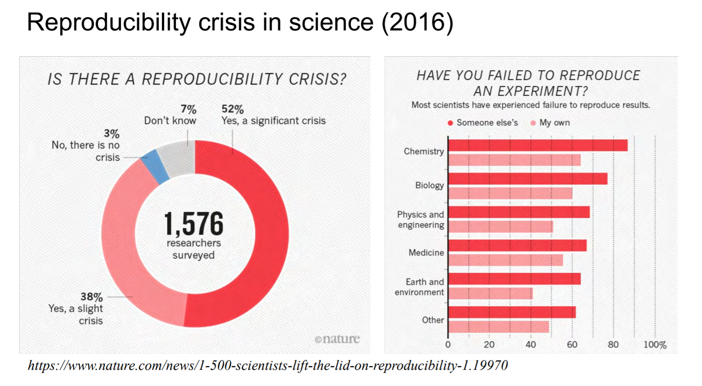
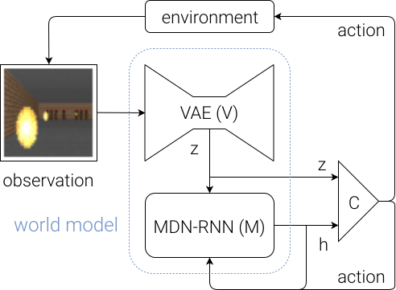

<!-- https://taolicheng.github.io/understanding-dnn/?p=NIPS2018_Summary_UdeM.md#1  -->
class: left, middle, inverse

[*click here to see the slides*](https://taolicheng.github.io/understanding-dnn/?p=NIPS2018_Summary_UdeM.md#1)

# [NeurIPS 2018](https://nips.cc) Summary Report

* [Overview and Statistics](#overview-and-statistics)
* [Conference Map](#conference-map)
* [Tutorials](#tutorials)
* [Highlights](#highlights)
* [Wisdom](#neurips2018-wisdom)

.footnote[{Taoli Cheng}]

---
name: overview-and-statistics

## Overview and Statistics
--

.grid[
.col-1-2[

]
.col-1-2[

]
]

---
count:pause

template: overview-and-statistics

.grid[
.col-1-2[

]
.col-1-2[

]
]

---
count: pause
template: overview-and-statistics

---
name: conference-map
## Conference Map

Conference Schedule: https://nips.cc/Conferences/2018/Schedule

- **Tutorials** (current trends)
- Talks: **Invited**, **Oral**, Spotlight (cutting-edges)
- Posters and Demonstrations
- Sponsor Demonstrations
- **Workshops** (specific topics)

---

.grid[

.col-1-4[
###2018 Trends

- Complex DL applications
- Reinforcement Learning
- Causal Learning
- Human and AI (human in the loop, neuronal networks)
]
.col-3-4[

]
]

---
name: tutorials
## Tutorials

<!--General trends **keywords**:       
-->

General trend **Keywords**: _Robustness_, _Bayesian_, _Unsupervised_, _Automatic_

--

### Adversarial Robustness [[slides]](https://media.neurips.cc/Conferences/NIPS2018/Slides/adversarial_ml_slides_parts_1_4.pdf)
.width-100[

]
---
.width-100[

]
---
.width-100[

]
---
.width-100[

]
---
.width-100[

]
---
.width-100[

]
---
.width-100[

]

---
### Unsupervised Learning [[slides1](https://media.neurips.cc/Conferences/NIPS2018/Slides/Deep_Unsupervised_Learning.pdf), [slides2](https://media.neurips.cc/Conferences/NIPS2018/Slides/graves-deeplearning2.pdf)], [[video](https://www.youtube.com/watch?v=rjZCjosEFpI)]

.width-100[

]
---
.width-100[

]
---
.width-100[

]
---
.width-100[

]
---
.width-100[

]
---
.width-100[

]
---
.width-100[

]
---
.width-100[

]
---
.width-100[

]
---
.width-100[

]
---
.width-100[

]

---
### Automatic ML [[video](https://www.youtube.com/watch?v=0eBR8a4MQ30), [website](https://www.automl.org/)]

### Statistical Learning

---
name: highlights
## Highlights

### Michael Levin: **What Bodies Think About: Bioelectric Computation Outside the Nervous System, Primitive Cognition, and Synthetic Morphology**, [[slides]](https://media.neurips.cc/Conferences/NIPS2018/Slides/Levin_bioelectric_computation.pdf)

.pull-left[
.width-100[]
]

.pull-right[
<iframe width="520" height="400" src="https://youtube.com/embed/RjD1aLm4Thg" frameborder="0" allow="encrypted-media" allowfullscreen></iframe>
]
---
.width-100[

]

---

.grid[
.col-1-3[.width-100[
[*flatworm recognizes home environment after head regeneration*]]
]

.col-1-5[]

.col-1-3[.width-80[[*closed loop*]]
]
]

.grid[
.col-1-3[.width-100[
[*Knowledge gap: genome <-> anatomy ???*]]
]

.col-1-5[]

.col-1-3[.width-80[[*electrical communication -> anatomical decisions*]]
]
]

---
class: middle, center

**pre-neural decision making in bioelectrical system** --> **robust new AI approach**/*Adaptive Learning*
  

---
### Joelle Pineau: **Reproducible, Reusable, and Robust Reinforcement Learning**, [[slides]](https://media.neurips.cc/Conferences/NIPS2018/Slides/jpineau-NeurIPS-dec18-fb.pdf)

.width-100[
]

---

.width-100[
]
---

class: middle

.grid[
.col-1-2[]
.col-1-2[]
] 

---

.width-100[]

---
name: highlight-presentations
## Highlight Presentations

--

### Algorithms
   * [**ConvRNN**](https://neuroailab.github.io/convrnns/files/convrnns-nips-2018-poster.pdf)
   * Modelling and unsupervised learning of symmetric deformable object categories, [pdf](http://papers.nips.cc/paper/8040-modelling-and-unsupervised-learning-of-symmetric-deformable-object-categories.pdf)
   * Learning Invariances using the Marginal Likelihood, [pdf](http://papers.nips.cc/paper/8199-learning-invariances-using-the-marginal-likelihood.pdf)
   * [Training deep learning based denoisers without ground truth data](https://drive.google.com/file/d/1yew0KcVrW4A8QPYgsMe3elCAAszhBXWs/view)
   * [**Deep Anomaly Detection with Geometic Transformations**](https://drive.google.com/file/d/1ZpoC35XzoAWtxg1jQbGBbhyTkuqvcyqh/view)
   * [Legendre decomposition for tensors](https://mahito.info/files/Sugiyama_NeurIPS2018_poster.pdf)
   * Flexible and accurate inference and learning for deep generative models, [pdf](http://papers.nips.cc/paper/7671-flexible-and-accurate-inference-and-learning-for-deep-generative-models.pdf)

---
#### ConvRNN

.width-70.center[]

 

- local cell architectures
- large-scale model search ("jointly optimized architectural
and learning hyperparameters using a Tree-structured Parzen Estimator (TPE)")
- neural dynamics

---
#### ConvRNN

.width-60.center[]
   
- "the most successful models exclusively used depth-separable convolutions
    for their local recurrent connections"
- "this search resulted in recurrent models that matched the
    performance of a much deeper feedforward architecture (ResNet-34) while using only ~ 75% as
    many parameters"

---
#### ConvRNN

.width-70.center[]

visual hierarchy: **V1** (primary visual cortex) -> **V4** (extrastriate visual areas) -> **PIT** (posterior inferotemporal cortex)

---
template: highlight-presentations

### Deep Learning and Applications
   * Adversarially Robust Generalization Requires More Data, [slides](https://nips.cc/media/Slides/nips/2018/517cd(04-15-30)-04-16-15-12614-Adversarially_R.pdf)
   * [Understanding batch normalization](https://drive.google.com/file/d/1hpt18ohp9BYBPOU3Qi5tky27bDIaAbJ-/view)
   * [Realistic Evaluation of Deep Semi-Supervised Learning Algorithms](https://colinraffel.com/posters/nips2018realistic.pdf)
   * generalisation of structural knowledge in the hippocampal entorhinal system, [pdf](http://papers.nips.cc/paper/8068-generalisation-of-structural-knowledge-in-the-hippocampal-entorhinal-system.pdf)
   * [**Learning Hierarchical Semantic Image Manipulation through Structured Representations**](https://arxiv.org/pdf/1808.07535.pdf)
   * Neural-Symbolic VQA: Disentangling Reasoning from Vision and Language Understanding, [pdf](http://papers.nips.cc/paper/7381-neural-symbolic-vqa-disentangling-reasoning-from-vision-and-language-understanding.pdf)
   * Layer-Wise Coordination between Encoder and Decoder for Neural Machine Translation, [pdf](http://papers.nips.cc/paper/8019-layer-wise-coordination-between-encoder-and-decoder-for-neural-machine-translation.pdf)
   * [Searching for Efficient Multi-Scale Architectures for Dense Image Prediction](http://liangchiehchen.com/doc/DPC_NIPS2018_Poster.pdf)
   * [Learning to Navigate in Cities Without a Map](https://drive.google.com/file/d/10iifFITIUGYm2TP84sH3C_558-7qx8lI/view)
   * [Reducing Network Agnostophobia](http://vast.uccs.edu/~adhamija/Papers/Reducing_Network_Agnostophobia/poster.pdf)
   * **The Sparse Manifold Transform**, [pdf](http://papers.nips.cc/paper/8251-the-sparse-manifold-transform.pdf)

---
#### Learning Hierarchical Semantic Image Manipulation through Structured Representations

.width-80.center[]

---
#### Learning Hierarchical Semantic Image Manipulation through Structured Representations

.width-80.center[]

---
#### Learning Hierarchical Semantic Image Manipulation through Structured Representations

.width-80.center[]

---
#### The Sparse Manifold Transform

---
template: highlight-presentations

### RL
   * **Recurrent World Models Facilitate Policy Evolution**, [pdf](http://papers.nips.cc/paper/7512-recurrent-world-models-facilitate-policy-evolution.pdf) https://worldmodels.github.io
   * [Learning to Play with Intrinsically-Motivated Self-Aware Agents](https://neuroailab.github.io/curiosity/files/learning-to-play-nips-2018-poster.pdf)
   * Breaking the Curse of Horizon: Infinite-Horizon Off-Policy Estimation, [slides](https://nips.cc/media/Slides/nips/2018/220cd(05-15-30)-05-15-30-12655-Breaking_the_Cu.pdf)
   * [Playing hard exploration games by watching YouTube](https://drive.google.com/file/d/17rSlj_GdqfSUi1AqORWc7Sp0QKmo3Jd-/view)

---
#### Recurrent World Models Facilitate Policy Evolution [[video]](https://www.youtube.com/watch?v=HzA8LRqhujk)

cognitively inspired world representation: experiences -> **mental world models** -> actions 

.width-60.center[]

---
#### Recurrent World Models Facilitate Policy Evolution 

.width-60.center[]

**spatial (->VAE) and temporal (->RNN) information**

---
#### Recurrent World Models Facilitate Policy Evolution 

.width-80.center[]

---
count: false
#### Recurrent World Models Facilitate Policy Evolution 

.width-80.center[]

---
count: false
#### Recurrent World Models Facilitate Policy Evolution 

.width-80.center[]

---
count: false
#### Recurrent World Models Facilitate Policy Evolution 

.width-80.center[]

---
#### Recurrent World Models Facilitate Policy Evolution 

.center[<iframe width="520" height="400" src="figs/NIPS2018/carracing_vae_compare.mp4" frameborder="0" allow="encrypted-media" allowfullscreen></iframe>
]

.caption[Left: *input*; Right: *generated*]

---
#### Recurrent World Models Facilitate Policy Evolution 

Iteratively Trained High Quality Generative Models -> fully explore the environment

.grid[
.col-1-2[<iframe width="450" height="300" src="figs/NIPS2018/pendulum01.mp4" frameborder="0" allow="encrypted-media" allowfullscreen></iframe>
 
1st iteration
]

.col-1-2[<iframe width="450" height="300" src="figs/NIPS2018/pendulum20.mp4" frameborder="0" allow="encrypted-media" allowfullscreen></iframe>
 
20th iteration
]
]

---
template: highlight-presentations

### Optimization theory
   * [Escaping saddle points in constrained optimization](https://aryanm.mit.edu/wp-content/uploads/sites/20/2018/11/1830_NIPS_2018.pdf)

### Neuro. and Cog.
   * A probabilistic population code based on neural samples, [pdf](http://papers.nips.cc/paper/7938-a-probabilistic-population-code-based-on-neural-samples.pdf)
   * Gradient Descent for Spiking Neural Networks, [pdf](http://papers.nips.cc/paper/7417-gradient-descent-for-spiking-neural-networks.pdf)

.footnote[tags: information theory, representation and interpretaion, ...]

---
name: workshop-highlights
## Workshop Highlights

--
### Causal Learning [[website]](https://sites.google.com/view/nips2018causallearning/home)

.pull-left[
.width-80[
]
]

.pull-right[
- causal confounding
- causal invariance
- counterfactual reasoning
- ...

]

---
.width-100[
]

---
.width-100[
]

---
#### Example: Woulda, coulda, shoulda: Counterfactually-guided policy search

---
template: workshop-highlights
### Interpretability and Robustness in Audio, Speech, and Language [[website]](https://irasl.gitlab.io/)

* Mike Schuster, “Learning from the move to neural machine translation at Google”

.width-80.center[
]

---
class: middle, center, inverse

#FIN!

---
class: middle, center, inverse

# To be continued...

---
name: neurips2018-4-lhc-physics
## NeurIPS2018  **4**  LHC Physics

### Anomaly Detection

---
name: neurips2018-wisdom
## NeurIPS2018 Wisdom

- “Machine Learning can make pigs fly” – Aleksander Madry
- Observations on crowd phenomena
